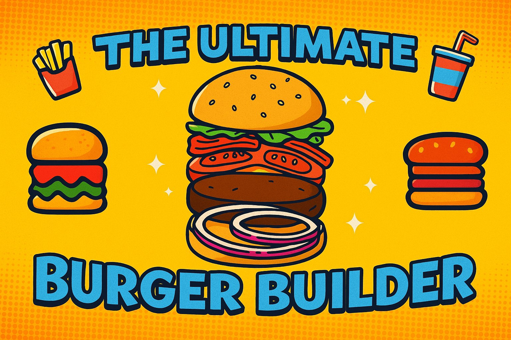
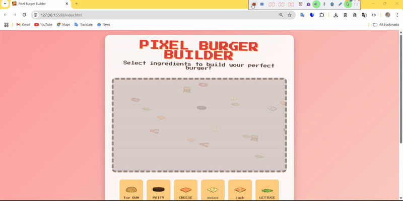
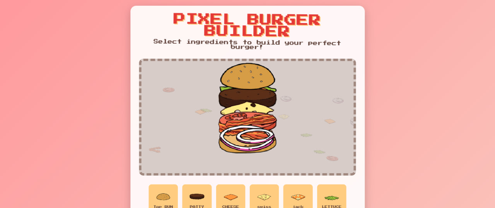
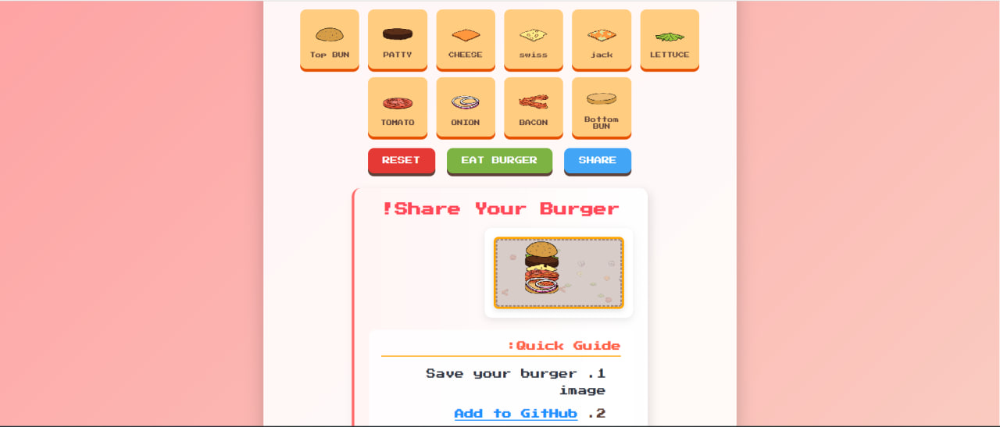

<!-- hey -->

# 🍔 The Ultimate Burger Builder



Welcome to **The Ultimate Burger Builder** — the most exciting coding challenge on GitHub!  
Your mission: **Create the most epic digital burger**, share it, and become a burger legend. 🏆

---

## 🎯 What is this?

It’s simple:

1. We provide burger ingredients 🥬🍅🧀🍔
2. You design your own digital burger masterpiece
3. You upload and share it here 🚀

---

## 🎥 Demo



---

## 🚀 **Live Demo**

Start building your dream burger now! 🍔✨  
Enjoy animated clicks and tasty ingredients.

<div align="center">
  <a href="https://vidakhoshpey22.github.io/Burger_Builder/">
    
  </a>
</div>

<div align="center">
  <a href="https://vidakhoshpey22.github.io/Burger_Builder/">
    
  </a>
</div>

---

## 🖼 Burger Hall of Fame

| Preview 1                         | Preview 2                         | Preview 3                         |
| --------------------------------- | --------------------------------- | --------------------------------- |
|  |  |  |

---

## 🛠 How to Join the Challenge

### 1️⃣ Fork this repository

Click the **Fork** button at the top-right to create your own copy of this repo.

### 2️⃣ Clone it to your computer

Open your terminal and run:

```bash
git clone https://github.com/VIDAKHOSHPEY22/Burger_Builder.git
```

### 3️⃣ Create Your Burger

- Use the ingredient images located in the `images/ingredients` folder.
- Design your burger by combining these ingredients.
- Save your final creation as a `.jpg` or `.png` file.

---

### 4️⃣ Add Your Burger to the Project

- Place your burger image inside the `Your_Images` directory.
- Name your file following this format: `burger_vidakhoshpey.png`

---

### 5️⃣ Update `CONTRIBUTIONS.md`

Add an entry with your name and burger image like this:

```markdown
- [Vida Khoshpey](Your_Images/burger_vidakhoshpey.png) — My delicious cheesy burger 🧀
```

---

### 6️⃣ Commit and Push Your Changes

```bash
git add .
git commit -m "Added my burger"
git push
```

---

### 7️⃣ Open a Pull Request

Go to your repository on GitHub.

Click Pull Requests → New Pull Request.

Submit your PR and wait for your burger to be featured in the gallery! 🎉

---

## 💬 Join the Fun in Discussions

- Vote for your favorite burgers
- Share your secret recipes
- Suggest new features (Pizza Builder is coming soon! 🍕)

[👉 Join the Discussions](../../discussions)

---

### 📂 Project Structure

```text

Hamburger/
├── images/             # All images (banner, demo gif, previews, ingredients)
│   ├── banner.jpg
│   ├── Demo.gif
│   ├── preview1.jpg
│   ├── preview2.jpg
│   ├── preview3.jpg
│   └── ingredients/    # Bacon, buns, cheese, lettuce, etc.
│
├── Your_Images/        # Contributors add their burger creations here
│
├── index.html          # Main webpage
├── CONTRIBUTIONS.md    # Burger credits list
├── LICENCE             # License information
└── README.md           # This file
```

---

## 📜 License

This project is licensed under the **Yalda & Vida Fun License**:  
You may fork, remix, and share your burger creations as long as you:

- Credit **Yalda & Vida**
- Keep it friendly and fun
- Respect all burger preferences (yes, even pineapple 🍍)

[View License](LICENCE)

---

## 👩‍🍳 Coming Soon

- 🍕 Pizza Builder
- 🌭 Hotdog Creator
- 🥪 Sandwich Architect

---

**Made with ❤️ by Vida & Yalda**
